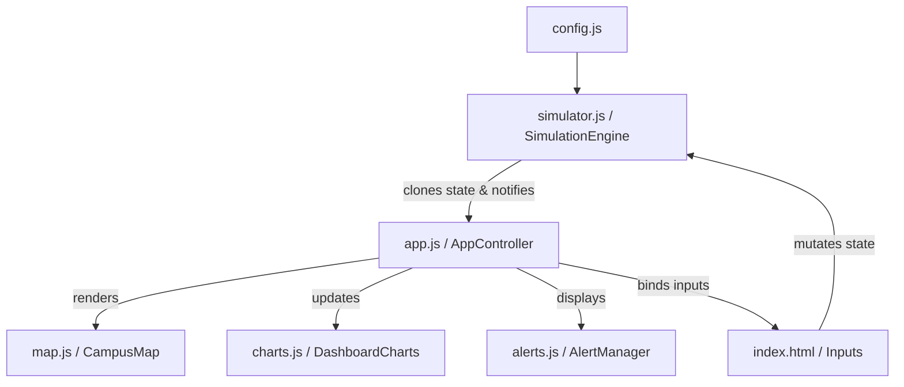

#  AURA Grid — Campus IoT & Smart Energy Monitoring Dashboard

AURA Grid is a responsive, high-performance smart campus energy management and grid optimization dashboard. Built on vanilla ES Modules and custom styling, it simulates real-world thermodynamic behaviors, solar farm outputs with atmospheric physics, and smart battery load-shifting heuristics for university campus grids.

---

##  User Personas

- **Campus Facilities Manager**: Monitors real-time peak loads across academic halls, hostels, labs, and administration buildings, resolving grid overload warnings before a brownout occurs.
- **Energy Auditor & Sustainability Officer**: Tracks daily carbon offsets prevented relative to standard grid emissions intensity and analyzes system load breakdowns to adjust HVAC setpoint rules.
- **Microgrid Operator**: Configures smart battery state-of-charge limits and schedules solar dispatch offsets to minimize expensive grid demand during peak hours.

---

##  System Architecture

The application is structured around a decoupled model-view-controller (MVC) architecture, separating physics simulation from visual presentation:



### Key Architectural Enhancements

1. **Decoupled Engine**: The core simulation math is isolated inside a pure `SimulationEngine` class. It accepts state transitions, runs calculation loops, and returns deep-cloned immutable state objects to listeners.
2. **Fixed-Step Integration with Chunked Execution**: Replaced volatile `requestAnimationFrame` loops with a drift-resistant fixed-step integrator (0.05h steps). When the tab is backgrounded and resumed, the simulation processes catch-up work in microtask chunks (max 50 steps/frame) to avoid blocking the main thread.
3. **Event Delegation**: Alert lists and leaderboard items use high-performance event delegation to prevent layout thrashing and listener memory leaks.
4. **Data Persistence**: Grid status, temperatures, resolved notifications, and accumulated carbon savings are automatically preserved in `localStorage` across reloads. A "Reset Grid" trigger cleans the telemetry buffer instantly.
5. **Audit Trail**: All Smart Grid auto-actions (HVAC setbacks, load shedding, battery conservation) emit audit log entries with timestamps, severity, and affected assets — viewable via toast notifications and persisted across sessions.
6. **Tariff Engine**: Indian grid tariff model with time-of-use energy charges (peak/standard/off-peak), demand charges (₹/kVA), power factor penalties/rebates, and GST — projecting monthly bills in real time.

---

## 🔬 Physics & Mathematics Models

AURA Grid does not use mock random transitions. All values are calculated from first-principles equations:

### 1. Thermodynamic HVAC Inertia
Building indoor temperature ($T_{in}$) drifts naturally towards outdoor temp ($T_{out}$) while HVAC systems pull the temp back to the target setpoint ($T_{set}$).

$$\frac{dT_{in}}{dt} = -k_{env}(T_{in} - T_{out}) - k_{hvac}(T_{in} - T_{set})$$

The engine integrates this using a stable, analytical exponential decay step (unconditionally stable, no timestep sensitivity):

$$T_{in}(t + \Delta t) = T_{set} + (T_{in}(t) - T_{set}) \cdot e^{-(k_{env} + k_{hvac})\Delta t}$$

*HVAC thermal effort (kW)* is derived directly from the rate of temperature correction and environmental heat transfer:

$$P_{hvac} = \left(|T_{set} - T_{in}| \cdot k_{hvac} \cdot 11.5 + |T_{out} - T_{in}| \cdot k_{env} \cdot 3.5\right) \cdot (1.0 + \text{occupancy} \cdot 0.5)$$

### 2. Solar Position & Irradiance (SPA Algorithm)
Solar generation uses the NREL Solar Position Algorithm (SPA) for accurate sun position at any latitude/longitude/date:
- Solar declination (Spencer 1971)
- Equation of time
- Hour angle → solar elevation & azimuth
- Air mass (Kasten-Young 1989)
- Bird Clear Sky Model for GHI (direct + diffuse)

$$GHI = DNI \cdot \sin(elevation) \cdot 0.85$$

**PV Temperature Derating**: Cell temperature estimated via NOCT model:
$$T_{cell} = T_{amb} + (NOCT - 20) \cdot \frac{GHI}{800}$$
$$P_{actual} = P_{STC} \cdot \left[1 + \gamma \cdot (T_{cell} - 25)\right]$$
where $\gamma = -0.004/°C$ (typical crystalline silicon).

Weather profiles (sunny/cloudy/rainy) apply multiplicative factors with deterministic seeded PRNG variance.

### 3. Integrated Battery Carbon Intensity
Stored energy carries a dynamic weighted-average carbon intensity based on charging sources (zero-carbon solar vs standard/off-peak grid mixes):

$$CI_{battery} = \frac{E_{prev} \cdot CI_{prev} + E_{added} \cdot CI_{added}}{E_{prev} + E_{added}}$$

When the battery discharges, carbon offsets are computed by subtracting the original embedded charge intensity from the displaced grid carbon mix:

$$\text{Savings} = P_{discharge} \cdot \Delta t \cdot (CI_{grid} - CI_{battery})$$

**Round-trip efficiency is accounted once on charge** — the embedded intensity already includes charging losses, so discharge savings use stored energy directly without double-counting.

---

##  Tariff & Cost Model (Indian Grid Example)

| Component | Peak (14-19h) | Standard | Off-Peak (23-5h) |
|-----------|---------------|----------|------------------|
| Energy Charge (₹/kWh) | 8.50 | 6.50 | 4.50 |
| Demand Charge (₹/kVA/mo) | 350 | — | — |
| Power Factor Target | 0.95 | — | — |
| PF Penalty (₹/%/mo) | 50 | — | — |
| PF Rebate (₹/%/mo) | 20 | — | — |
| Fixed Charge (₹/mo) | 5,000 | — | — |
| GST | 18% | — | — |

The dashboard projects:
- **Accumulated Energy Cost** (MTD)
- **Current Max Demand** (kVA)
- **Projected Demand Charge**
- **Total Projected Monthly Bill** (with GST)

---

## 🛠️ Setup & Local Running

1. **Install dependencies**:
   ```bash
   npm install
   ```

2. **Run dev server**:
   ```bash
   npm run dev
   ```

3. **Build production bundle**:
   ```bash
   npm run build
   ```

4. **Run tests**:
   ```bash
   npm run test
   ```

---

##  Testing

AURA Grid contains unit test coverage verifying the correctness of all thermodynamic drift formulas, solar position calculations, weather multipliers, battery charging efficiencies, tariff tracking, and dynamic alert rules.

Run the test suite using **Vitest**:
```bash
npm run test
```

Test categories:
- Thermodynamic integration stability
- Solar output across weather profiles
- Battery efficiency round-trip bounds
- Carbon savings accumulation
- Auto-resolution of alerts with audit trail
- Deterministic seeded PRNG for reproducible simulations

---

##  Project Structure

```
├── index.html              # Main HTML entry point
├── index.css               # Complete styling (CSS custom properties, glassmorphism, responsive)
├── app.js                  # AppController - MVC glue, DOM bindings, simulation loop
├── package.json            # Dependencies & scripts
├── .gitignore              # Ignored files
├── .env.example            # Environment variable template
├── .github/workflows/ci.yml # GitHub Actions CI/CD
├── components/
│   ├── config.js           # All physics constants, campus geo, tariff, building specs
│   ├── simulator.js        # SimulationEngine - pure physics, fixed-step, immutable state
│   ├── charts.js           # DashboardCharts - ApexCharts wrapper (live + 24h modes)
│   ├── map.js              # CampusMap - inline SVG with animated power flows
│   ├── alerts.js           # AlertManager - event delegation, XSS-safe rendering
│   ├── utils.js            # Polyfills, sanitization, solar SPA, audit log, storage
│   └── simulator.test.js   # Vitest test suite
└── dist/                   # Production build output (generated)
```

---

##  Configuration

All physics constants, campus geography, building specs, and tariff rates are centralized in `components/config.js`. Modify these to match your campus:

- `APP_CONFIG.campus` — latitude, longitude, timezone
- `APP_CONFIG.battery` — capacity, charge/discharge rates, efficiency
- `APP_CONFIG.physics` — thermal coefficients, PV temp coefficient
- `APP_CONFIG.carbonIntensity` — grid emission factors (kg CO₂/kWh)
- `APP_CONFIG.tariff` — energy charges, demand charges, PF rules
- `INITIAL_BUILDINGS_CONFIG` — per-building base load, HVAC setpoint, capacity, occupancy profile

---

##  Accessibility

- Semantic HTML structure with ARIA roles (`tablist`, `tab`, `aria-selected`, `aria-controls`)
- Focus-visible outlines on all interactive elements
- Color-blind safe palette (green/amber/red with shape/icon redundancy)
- Keyboard-navigable chart mode tabs and weather selectors
- Screen-reader friendly alert announcements via `aria-live` regions

---

##  Bundle Size Note

The production bundle is ~665 kB (186 kB gzipped), primarily due to **ApexCharts** (~500 kB). For size-constrained environments, consider:
- Dynamic `import()` for charts (code-split)
- Lightweight Canvas/SVG chart alternative (~200 lines)
- `build.rollupOptions.output.manualChunks` to separate vendor chunk

---

##  CI/CD

GitHub Actions workflow (`.github/workflows/ci.yml`) runs on every push/PR:
1. Install dependencies (`npm ci`)
2. Run test suite (`npm run test`)
3. Build production bundle (`npm run build`)
4. Upload `dist/` as artifact
5. Deploy to GitHub Pages on `main` branch (optional)

---

##  License

MIT License — feel free to use, modify, and distribute.