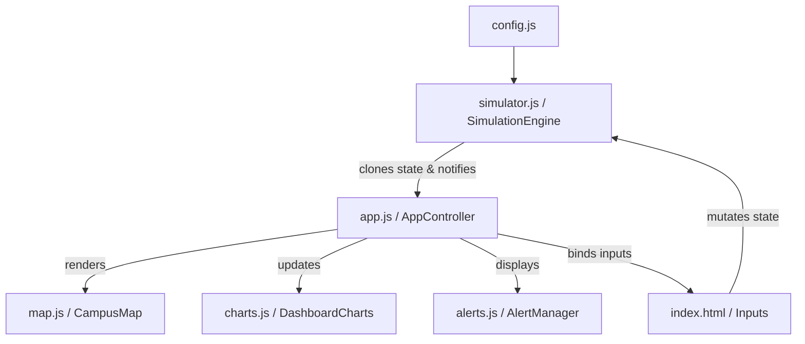

# ⚡ AURA Grid — Campus IoT & Smart Energy Monitoring Dashboard

AURA Grid is a responsive, high-performance, and mathematically rigorous smart campus energy management and grid optimization dashboard. Built on vanilla ES Modules and custom styling, it simulates real-world thermodynamic behaviors, solar farm outputs, and smart battery load-shifting heuristics for university campus grids.

---

## 👥 User Personas

- **Campus Facilities Manager**: Monitors real-time peak loads across academic halls, hostels, labs, and administration buildings, resolving grid overload warnings before a brownout occurs.
- **Energy Auditor & Sustainability Officer**: Tracks daily carbon offsets prevented relative to standard grid emissions intensity and analyzes system load breakdowns to adjust HVAC setpoint rules.
- **Microgrid Operator**: Configures smart battery state-of-charge limits and schedules solar dispatch offsets to minimize expensive grid demand during peak hours.

---

## 🏗️ System Architecture

The application is structured around a decoupled model-view-controller (MVC) architecture, separating physics simulation from visual presentation:



### Key Architectural Enhancements
1. **Decoupled Engine**: The core simulation math is isolated inside a pure `SimulationEngine` class. It accepts state transitions, runs calculation loops, and returns deep-cloned immutable state objects to listeners.
2. **Drift-Free Timing**: Replaced volatile browser-based requestAnimationFrame loops with a drift-free time tracking loop that runs step-by-step integrations iteratively. When the tab is backgrounded and resumed, the simulation scales mathematically to recover lost time correctly without physics degradation.
3. **Event Delegation**: Alert lists and leaderboard items use high-performance event delegation to prevent layout thrashing and listener memory leaks.
4. **Data Persistence**: Grid status, temperatures, resolved notifications, and accumulated carbon savings are automatically preserved in `localStorage` across reloads. A "Reset Grid" trigger cleans the telemetry buffer instantly.

---

## 🔬 Physics & Mathematics Models

AURA Grid does not use mock random transitions. All values are calculated from first-principles equations:

### 1. Thermodynamic HVAC Inertia
Building indoor temperature ($T_{in}$) drifts naturally towards outdoor temp ($T_{out}$) while HVAC systems pull the temp back to the target setpoint ($T_{set}$).
$$\frac{dT_{in}}{dt} = -k_{env}(T_{in} - T_{out}) - k_{hvac}(T_{in} - T_{set})$$
The engine integrates this using a stable, analytical exponential decay step:
$$T_{in}(t + \Delta t) = T_{set} + (T_{in}(t) - T_{set}) \cdot e^{-(k_{env} + k_{hvac})\Delta t}$$
*HVAC thermal effort (kW)* is then derived directly from the rate of temperature correction and environmental heat transfer:
$$P_{hvac} = \left(|T_{set} - T_{in}| \cdot k_{hvac} \cdot 11.5 + |T_{out} - T_{in}| \cdot k_{env} \cdot 3.5\right) \cdot (1.0 + \text{occupancy} \cdot 0.5)$$

### 2. Atmospheric Solar Scattering Curve
Solar generation ($P_{solar}$) follows a sinusoidal solar altitude curve peaking at 1:00 PM, attenuated by weather profiles and morning/evening atmospheric scattering when the sun is at low angles:
$$P_{solar} = P_{max} \cdot \sin(\theta) \cdot (w_{factor} + \text{noise}) \cdot s_{factor}$$
Where $\theta$ is daylight Sun angle, $w_{factor}$ is the weather profile multiplier, and $s_{factor}$ is a linear scatter ramp from sunrise/sunset limits.

### 3. Integrated Battery Carbon Intensity
Stored energy in the smart battery carries a dynamic weighted-average carbon intensity based on its charging sources (zero-carbon solar vs standard/off-peak grid mixes):
$$CI_{battery} = \frac{E_{prev} \cdot CI_{prev} + E_{added} \cdot CI_{added}}{E_{prev} + E_{added}}$$
When the battery discharges, carbon offsets are computed by subtracting the original embedded charge intensity from the displaced grid carbon mix:
$$\text{Savings} = P_{discharge} \cdot \Delta t \cdot (CI_{grid} - CI_{battery})$$

---

## 🛠️ Setup & Local Running

1. **Install dependencies**:
   ```bash
   npm install
   ```

2. **Run dev server**:
   ```bash
   npm run dev
   ```

3. **Build production bundle**:
   ```bash
   npm run build
   ```

---

## 🧪 Testing

AURA Grid contains unit test coverage verifying the correctness of all thermodynamic drift formulas, weather multipliers, battery charging efficiencies, and dynamic alert rules.

Run the test suite using **Vitest**:
```bash
npm run test
```
